# Mermaid Support in GitHub

## current version

```mermaid
  info
```
## basics

Here is a simple flow chart:


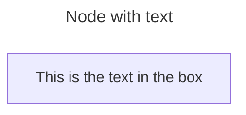

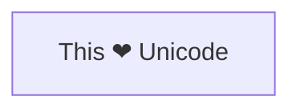

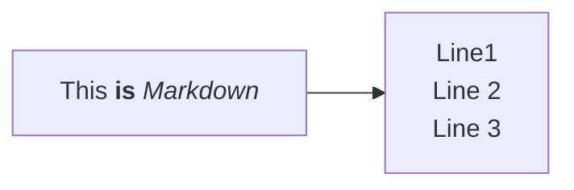

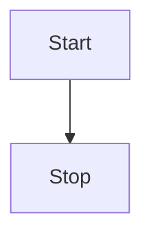
## shapes

### A node (rhombus)

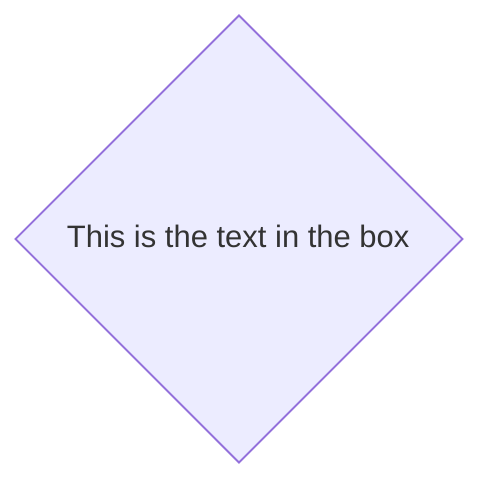

### A hexagon node

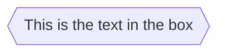

### Parallelogram

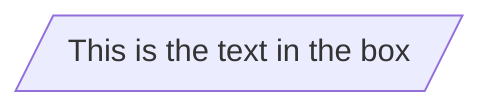

### Parallelogram alt

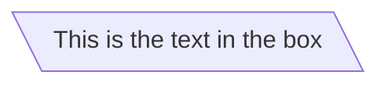

### Trapezoid

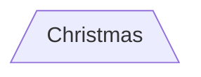

### Trapezoid alt

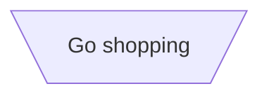

### Double circle

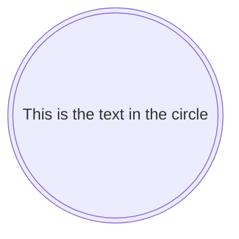
## Example Flowchart with New Shapes

Here’s an example flowchart that utilizes some of the newly introduced shapes:

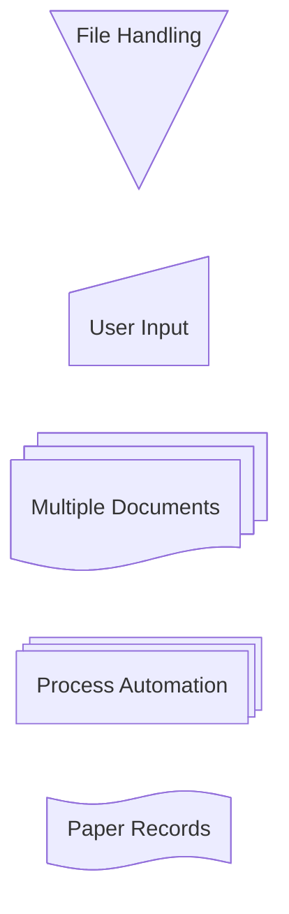

### Process

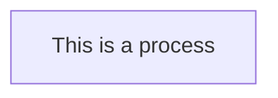

### Event

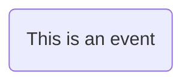

### Terminal Point (Stadium)

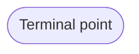

### Subprocess

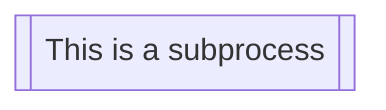

### Database (Cylinder)

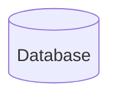

### Start (Circle)

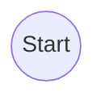

### Odd

```mermaid
flowchart TD
    A@{ shape: odd, label: "Odd shape" }
```

### Decision (Diamond)

```mermaid
flowchart TD
    A@{ shape: diamond, label: "Decision" }
```

### Prepare Conditional (Hexagon)

```mermaid
flowchart TD
    A@{ shape: hex, label: "Prepare conditional" }
```

### Data Input/Output (Lean Right)

```mermaid
flowchart TD
    A@{ shape: lean-r, label: "Input/Output" }
```

### Data Input/Output (Lean Left)

```mermaid
flowchart TD
    A@{ shape: lean-l, label: "Output/Input" }
```

### Priority Action (Trapezoid Base Bottom)

```mermaid
flowchart TD
    A@{ shape: trap-b, label: "Priority action" }
```

### Manual Operation (Trapezoid Base Top)

```mermaid
flowchart TD
    A@{ shape: trap-t, label: "Manual operation" }
```

### Stop (Double Circle)

```mermaid
flowchart TD
    A@{ shape: dbl-circ, label: "Stop" }
```

### Text Block

```mermaid
flowchart TD
    A@{ shape: text, label: "This is a text block" }
```

### Card (Notched Rectangle)

```mermaid
flowchart TD
    A@{ shape: notch-rect, label: "Card" }
```

### Lined/Shaded Process

```mermaid
flowchart TD
    A@{ shape: lin-rect, label: "Lined process" }
```

### Start (Small Circle)

```mermaid
flowchart TD
    A@{ shape: sm-circ, label: "Small start" }
```

### Stop (Framed Circle)

```mermaid
flowchart TD
    A@{ shape: framed-circle, label: "Stop" }
```

### Fork/Join (Long Rectangle)

```mermaid
flowchart TD
    A@{ shape: fork, label: "Fork or Join" }
```

### Collate (Hourglass)

```mermaid
flowchart TD
    A@{ shape: hourglass, label: "Collate" }
```

### Comment (Curly Brace)

```mermaid
flowchart TD
    A@{ shape: comment, label: "Comment" }
```

### Comment Right (Curly Brace Right)

```mermaid
flowchart TD
    A@{ shape: brace-r, label: "Comment" }
```

### Comment with braces on both sides

```mermaid
flowchart TD
    A@{ shape: braces, label: "Comment" }
```

### Com Link (Lightning Bolt)

```mermaid
flowchart TD
    A@{ shape: bolt, label: "Communication link" }
```

### Document

```mermaid
flowchart TD
    A@{ shape: doc, label: "Document" }
```

### Delay (Half-Rounded Rectangle)

```mermaid
flowchart TD
    A@{ shape: delay, label: "Delay" }
```

### Direct Access Storage (Horizontal Cylinder)

```mermaid
flowchart TD
    A@{ shape: das, label: "Direct access storage" }
```

### Disk Storage (Lined Cylinder)

```mermaid
flowchart TD
    A@{ shape: lin-cyl, label: "Disk storage" }
```

### Display (Curved Trapezoid)

```mermaid
flowchart TD
    A@{ shape: curv-trap, label: "Display" }
```

### Divided Process (Divided Rectangle)

```mermaid
flowchart TD
    A@{ shape: div-rect, label: "Divided process" }
```

### Extract (Small Triangle)

```mermaid
flowchart TD
    A@{ shape: tri, label: "Extract" }
```

### Internal Storage (Window Pane)

```mermaid
flowchart TD
    A@{ shape: win-pane, label: "Internal storage" }
```

### Junction (Filled Circle)

```mermaid
flowchart TD
    A@{ shape: f-circ, label: "Junction" }
```

### Lined Document

```mermaid
flowchart TD
    A@{ shape: lin-doc, label: "Lined document" }
```

### Loop Limit (Notched Pentagon)

```mermaid
flowchart TD
    A@{ shape: notch-pent, label: "Loop limit" }
```

### Manual File (Flipped Triangle)

```mermaid
flowchart TD
    A@{ shape: flip-tri, label: "Manual file" }
```

### Manual Input (Sloped Rectangle)

```mermaid
flowchart TD
    A@{ shape: sl-rect, label: "Manual input" }
```

### Multi-Document (Stacked Document)

```mermaid
flowchart TD
    A@{ shape: docs, label: "Multiple documents" }
```

### Multi-Process (Stacked Rectangle)

```mermaid
flowchart TD
    A@{ shape: processes, label: "Multiple processes" }
```

### Paper Tape (Flag)

```mermaid
flowchart TD
    A@{ shape: flag, label: "Paper tape" }
```

### Stored Data (Bow Tie Rectangle)

```mermaid
flowchart TD
    A@{ shape: bow-rect, label: "Stored data" }
```

### Summary (Crossed Circle)

```mermaid
flowchart TD
    A@{ shape: cross-circ, label: "Summary" }
```

### Tagged Document

```mermaid
flowchart TD
    A@{ shape: tag-doc, label: "Tagged document" }
```

### Tagged Process (Tagged Rectangle)

```mermaid
flowchart TD
    A@{ shape: tag-rect, label: "Tagged process" }
```
### Font Awesome shape

```mermaid
flowchart TD
    A@{ icon: "fa:user", form: "square", label: "User Icon", pos: "t", h: 60 }
```

## Links between nodes

### A link with arrow head

```mermaid
flowchart LR
    A-->B
```

### An open link

```mermaid
flowchart LR
    A --- B
```

### Text on links

```mermaid
flowchart LR
    A-- This is the text! ---B
```

or

```mermaid
flowchart LR
    A---|This is the text|B
```

### A link with arrow head and text

```mermaid
flowchart LR
    A-->|text|B
```

or

```mermaid
flowchart LR
    A-- text -->B
```

### Dotted link

```mermaid
flowchart LR
   A-.->B;
```

### Dotted link with text

```mermaid
flowchart LR
   A-. text .-> B
```

### Thick link

```mermaid
flowchart LR
   A ==> B
```

### Thick link with text

```mermaid
flowchart LR
   A == text ==> B
```

### An invisible link

This can be a useful tool in some instances where you want to alter the default positioning of a node.

```mermaid
flowchart LR
    A ~~~ B
```

### Chaining of links

It is possible declare many links in the same line as per below:

```mermaid
flowchart LR
   A -- text --> B -- text2 --> C
```

It is also possible to declare multiple nodes links in the same line as per below:

```mermaid
flowchart LR
   a --> b & c--> d
```

You can then describe dependencies in a very expressive way. Like the one-liner below:

```mermaid
flowchart TB
    A & B--> C & D
```
