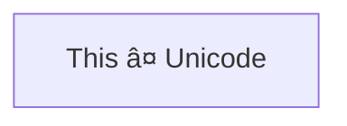

# Mermaid Support in GitHub

## current version

```mermaid
  info
```
## basics

Here is a simple flow chart:





## shapes

### A node (rhombus)


### A hexagon node


### Parallelogram


### Parallelogram alt


### Trapezoid


### Trapezoid alt


### Double circle


