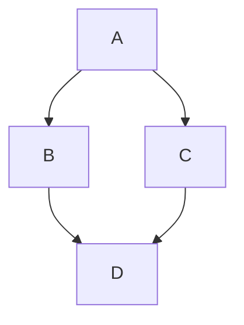
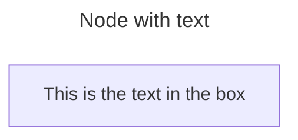
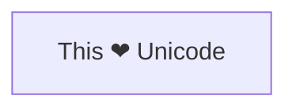
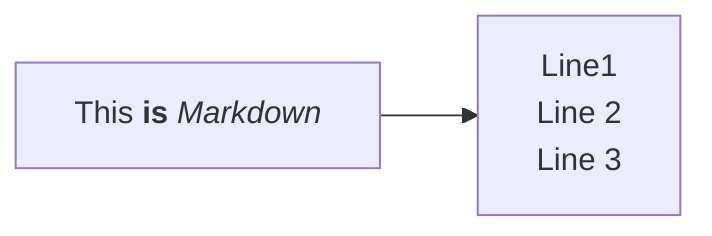

# Mermaid Support in GitHub

## current version

```mermaid
  info
```

Here is a simple flow chart:

```mermaid
graph TD
    A-->B
    A-->C
    B-->D
    C-->D
```

```mermaid
---
title: Node with text
---
flowchart LR
    id1[This is the text in the box]
```

```mermaid
flowchart LR
    id["This ❤ Unicode"]
```

```mermaid
%%{init: {"flowchart": {"htmlLabels": false}} }%%
flowchart LR
    markdown["`This **is** _Markdown_`"]
    newLines["`Line1
    Line 2
    Line 3`"]
    markdown --> newLines
```

